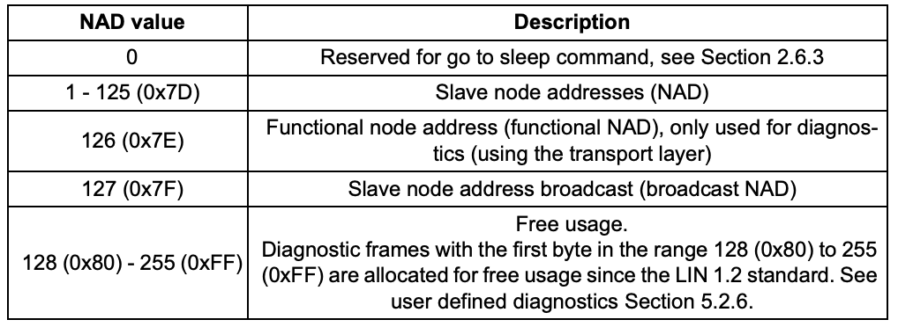
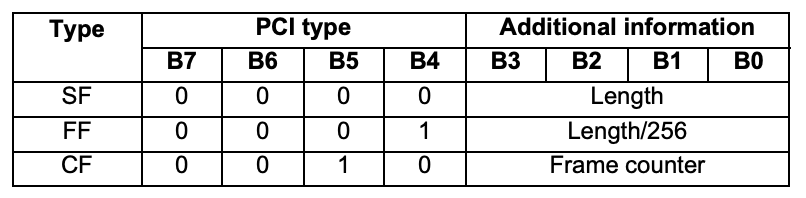

# LIN Explained

@ Based on: LIN-Spec_2.2_Rev_A

## Transport Layer

### NAD:

Node Address for slave nodes. Diagnostic frames are broadcasted and the NAD 
specifies the addressed, respectively responding slave node. The NAD is the
address of a logical node.

### PCI

The PCI (Protocol Control Information) contains the transport layer flow control information. Three interpretations of the PCI byte exist.

The PCI type Single Frame (SF) indicates that the transported message fits into the
single PDU, i.e. it contains at maximum five data bytes. The length shall then be set to
the number of used data bytes plus one (for the SID or RSID).

The PCI type First Frame (FF) is used to indicate the start of a multi PDU message;
the following frames are of CF type, see below. The total number of data bytes in the
message plus one (for the SID or RSID) shall be transmitted as Length: The four most
significant bits of Length is transmitted in the PCI byte (the eight least significant bits are sent in LEN, see below).

A multi-PDU message is continued with a number of Consecutive Frames (CF). The
first CF frame of a message is numbered 1, the second 2 and so on. If more than 15
CF PDUs are needed to transport the complete message, the frame counter wraps
around and continues with 0, 1,...

### SID

The Service Identifier (SID) specifies the request that shall be performed by the slave
node addressed. 0 to 0xAF and 0xB8 to 0xFE are used for diagnostics while 0xB0 to
0xB7 are used for node configuration. 

The Response Service Identifier (RSID) specifies the contents of the response.

## Schedule Tables

A key property of the LIN protocol is the use of schedule tables. Schedule tables make
it possible to assure that the bus will never be overloaded. They are also the key component to guarantee the periodicy of signals.

Deterministic behavior is made possible by the fact that all transfers in a LIN cluster
are initiated by the master task. It is the responsibility of the master node to assure
that all frames relevant in a mode of operation are given enough time to be transferred.